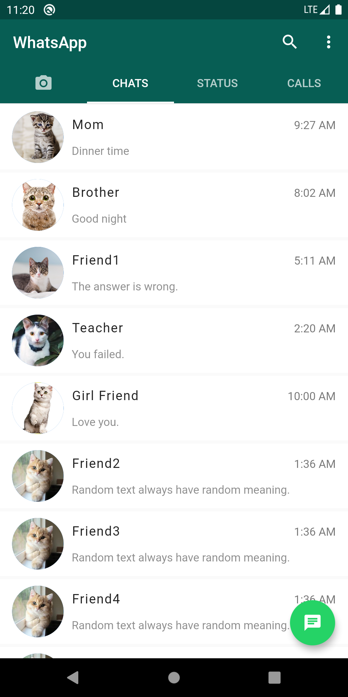
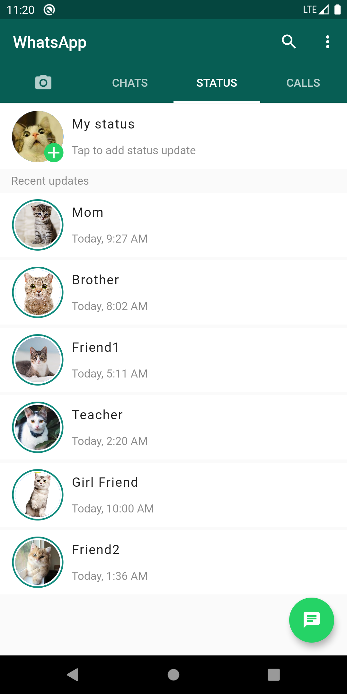
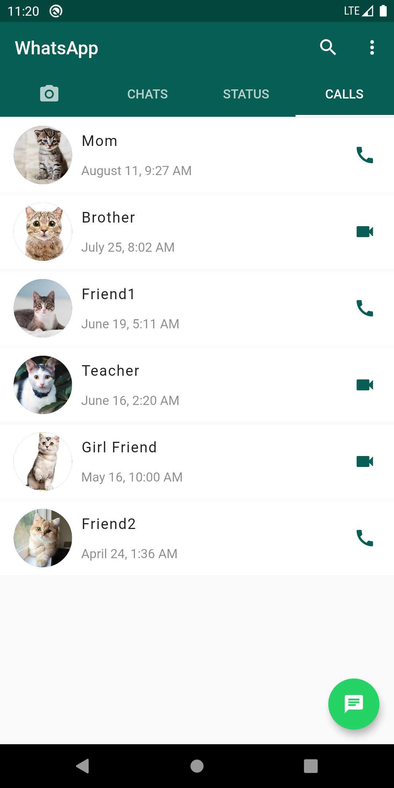
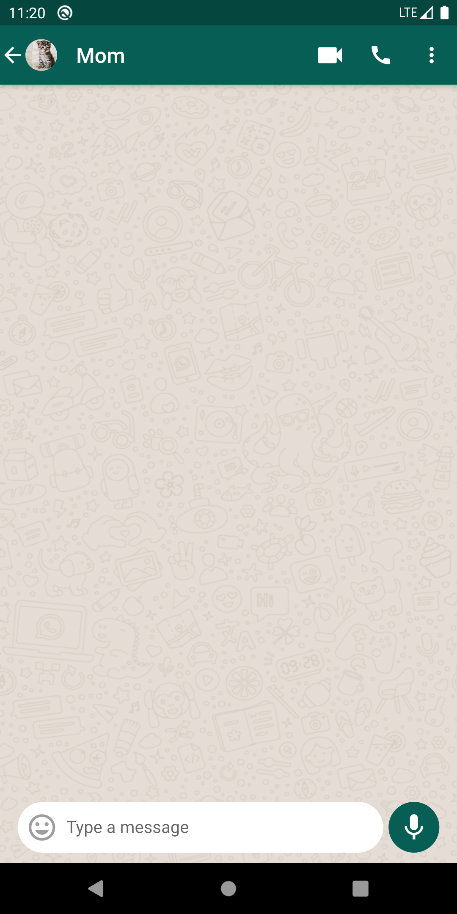

# WhatsApp Clone
Complete User Interface of WhatsApp in Flutter.
 
### Languages & tools :
[][android]
[][dart]
[][flutter]
  

|WhatsApp Home| WhatsApp Status | WhatsApp Calls | WhatsApp Chats|
|------|-------|-------|------|
|||||

### Directory Structure :
    |-- whatsapp_clone
    |    |-- android
    |    |
    |    |-- Assets
    |    |   |--Images
    |    |       |-- bc.png
    |    |       |-- imgr0.jpg
    |    |       |-- img1.jpg
    |    |       |-- img2.jpg
    |    |       |-- img3.jpg
    |    |       |-- img4.jpg
    |    |       |-- img5.jpg
    |    |       |-- img6.jpg
    |    |
    |    |-- ios
    |    |
    |    |-- lib
    |    |   |-- data
    |    |   |   |-- Calls.dart
    |    |   |   |-- Contacts.dart
    |    |   |   |-- Status.dart
    |    |   |
    |    |   |-- screens  
    |    |   |   |-- calls_page.dart
    |    |   |   |-- camera_page.dart
    |    |   |   |-- chats_screen.dart
    |    |   |   |-- home_page.dart
    |    |   |   |-- status_page.dart
    |    |   |   
    |    |   |-- widgets
    |    |   |   |-- message_composer.dart
    |    |   |
    |    |   |-- main.dart
    |    |
    |    |-- pubspec.lock
    |    |-- pubspec.yaml
    |    |-- README.md
    |
    |-- Img
    |    |-- androidstudio.png
    |    |-- dart.png
    |    |-- flutter.png
    |    |-- WhatsApp1.png
    |    |-- WhatsApp2.png
    |    |-- WhatsApp3.png
    |    |-- WhatsApp4.png

### Connect with me :  

  
 

[website]: https://abhilashtuofficial.github.io/
[dart]: https://github.com/AbhilashTUofficial/CloneApps
[flutter]: https://github.com/AbhilashTUofficial/CloneApps
[android]: https://github.com/AbhilashTUofficial/CloneApps

